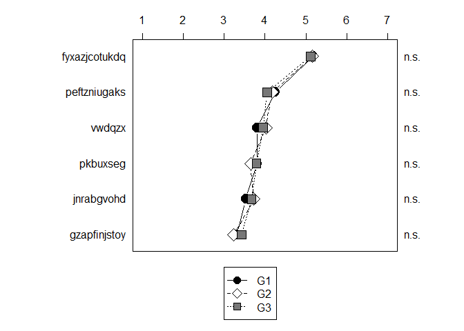

# Analysing and visualising rating scales in R using ratingScaleSummary
Till Krenz  
`r Sys.Date()`  


# ratingScaleSummary

This package is supposed to give a fast and useful summary and visualisation
of a rating scale, consisting of several variables using the same categories/
codings. These procedures might be useful for social scientists and psychologists
and everyone else working with data collected via surveys making use of the the
concept of multiple indicators for the measurment of dimensions of abstract or
complex social concepts and terms. 

In addition there are functions for calculating the interpolated median
and percentiles of a grouped frequency distribution, the inter quartile range,
and relative frequency and cross tables. The latter functions produce data
frames, the output is therefore modified and reused much easier, than the
outputs created by, e.g. the functions of the package 'descr'. The functions in
this package produce output that is supposed to be easily integrated into
RMarkdown and knitr files.

# Install Package

For now the ratingSclaeSummary package is not available on CRAN, but it can be
installed driectly from github from within R using the devtools package

    devtools::install_github('ratingScaleSummary/tilltnet')

or by using the source package for a local install.

# Let's get started: creating sample data

We start with creating some sample data, that will be used throughout this
vignette. We'll need a *data.frame* consisting of several variables, all using the
same categories. In addition we create a grouping variable, that is used for
the examples that incorporate group comparisson.


```r
df <- data.frame(replicate(6,sample(as.character(1:7), 2000, replace = T, prob = sample(1:100/100, 7))))
var_names <- lapply(1:6, FUN = function(x) paste(sample(letters, sample(6:13, 1)), collapse = ""))
names(df) <- var_names

g <- sample(c("G1", "G2", "G3"), 2000, replace = T)
```


# Summarise a rating scale

rs_summary() returns a **data.frame** where each row
represents one variable. It provides categories' frequencies (in %),
N, median, and the interquartile range.

```r
library(ratingScaleSummary)
res <- rs_summary(df = df)
knitr::kable(res)
```

|              |    1|    2|    3|    4|    5|    6|    7|    N| Median| intQR| NA|
|:-------------|----:|----:|----:|----:|----:|----:|----:|----:|------:|-----:|--:|
|djognmckleq   | 11.5| 10.7| 26.2| 23.4| 11.0|  9.7|  7.6| 2000|  3.571| 2.188|  0|
|baxihcvepyswj | 24.8| 10.9| 11.2| 21.4|  1.1|  6.0| 24.5| 2000|  3.643| 4.899|  0|
|htafczvdxlp   | 19.4|  0.6| 26.2|  8.9| 24.6|  7.0| 13.2| 2000|  3.919| 2.616|  0|
|dblzophye     | 13.9|  6.9| 22.8|  7.6| 18.2|  9.9| 20.6| 2000|  4.337| 3.377|  0|
|ohkfeblu      | 23.4| 10.9|  4.9| 10.2| 17.2| 21.8| 11.6| 2000|  4.535| 4.239|  0|
|iqajyf        | 13.7|  2.9| 13.4| 12.4| 20.4| 18.9| 18.2| 2000|  4.869| 3.015|  0|

The rs_summary() command gives a summary of the

## Visualise medians of a rating scale

vert_line_base() and vert_line_gg() plots a vertical line dot plot using base plotting or ggplot2.


```r
# Using base plot.
vert_line_base(x = res["Median"], max_val = 7)
```

<!-- -->

```r
# Using ggplot2.
vert_line_gg(x = res["Median"], max_val = 7)
```

<!-- -->

# Compare the responses to a rating scale by groups

Returns a **data.frame** where each row represents one variable
and the columns show the median values of the comparison groups. An additional
colum shows the significance levels, based on the **Kruskal-Wallis** **Rank**
**Sum** **Test**.


```r
# Compare medians between groups accross several variables.
res_comp <- rs_compare_groups(df = df, groups = g)
```

```
## Warning in rs_compare_groups(df = df, groups = g): 'groups' is not a
## factor. Converting to factor.
```

```r
knitr::kable(res_comp)
```

|                |    G1  |    G2   |   G3  |sig  
|:-------------- |: ------|:  ------|:------|:-----
|hsglau          | 3.213  | 3.239   |3.219  |n.s. 
|nthdroqjfswke   | 4.086  | 3.947   |4.090  |n.s. 
|waqxgklind      | 4.142  | 4.233   |4.149  |n.s. 
|nceiurbskaphy   | 4.495  | 4.732   |4.817  |n.s. 
|phausnzkorxi    | 4.500  | 4.807   |4.464  |n.s. 
|fbixvpyjac      | 5.402  | 5.301   |5.202  |n.s. 

## Visualise the comparisson

vert_line_base() and vert_line_gg() also produce plots for group comparisson.


```r
# Using base plot.
vert_line_base(x = res_comp, max_val = 7)
```

<!-- -->

```r
# Using ggplot2.
vert_line_gg(x = res_comp, max_val = 7)
```

<!-- -->

# Using ggplot2 theming


```r
library(ggthemes)
vert_line_gg(x = res["Median"], max_val = 7) +  theme_hc()
```

<!-- -->

```r
vert_line_gg(x = res_comp, max_val = 7) + theme_wsj()
```

<!-- -->


# Miscellaneous functions within the package

 - gmedian() calculates the interpolated median of a grouped
   frequency distribution.
 - intQR() calculates interquartile range of a grouped frequency
   distribution.
 - mQ() Calculates halfed interquartile range [german: mittlerer 
   Quartilsabstand] of a grouped frequency distribution
 - f_tab() returns a \emph{data.frame} where each row shows the
   frequencies of unique values in a vector. Weighting is supported.
 - x_tab() returns a \emph{data.frame} as a crosstable with indication of 
   statistic significance using chi-square. Weighting is supported.
